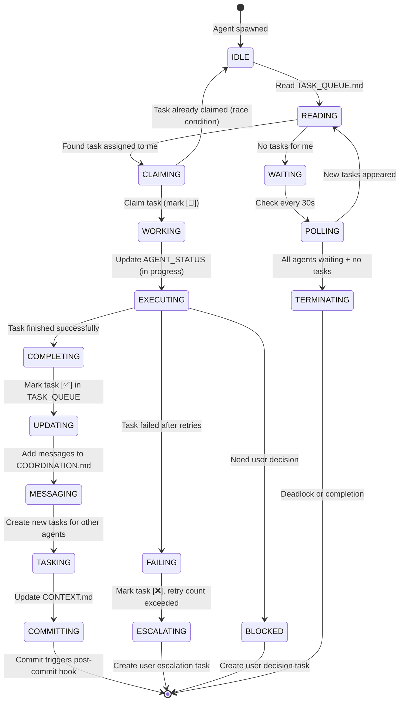

# Continuous Autonomous AI Development Loop Design

**Version**: 1.0.0
**Date**: 2025-11-21
**Purpose**: Multi-agent event-driven system for continuous autonomous development

---

## 🎯 Overview

A **self-sustaining development loop** where Claude Code subagents work continuously, adding tasks for each other, completing work, and using git commits as synchronization points.

### Core Concept

```
┌─────────────────────────────────────────────────────────────┐
│  CONTINUOUS LOOP (No Human Intervention)                    │
│                                                              │
│  Agent A commits → post-commit hook → Spawn Agent B         │
│  Agent B works → Adds task for Agent C → Commits            │
│  post-commit hook → Spawn Agent C → Agent C works...        │
│                                                              │
│  Loop continues until TASK_QUEUE.md is empty                │
└─────────────────────────────────────────────────────────────┘
```

---

## 🏗️ Architecture

### 1. Shared State Files (Communication Layer)

#### **TASK_QUEUE.md** - Central Task Board
```markdown
# Autonomous Development Task Queue

**Last Updated**: 2025-11-21T14:30:00Z
**Active Agents**: 3 (developer, auditor, tester)
**Pending Tasks**: 5

---

## 🔴 High Priority (P0 - Critical)

- [ ] #2 `[debugger]` Fix HIPAA violation in patient_search.py:45 **@auditor** (created: 14:25:00)
  - **Blocker**: Merge blocked until fixed
  - **Context**: PHI exposed in application logs
  - **Files**: backend/app/services/patient_search_service.py

## 🟡 Normal Priority (P1 - Important)

- [🔄] #1 `[developer]` Implement Task 5.4.1 - Filter UI component **@architecture-designer** (claimed: 14:20:00)
  - **Agent PID**: 12345
  - **Status**: 60% complete (tests passing, implementing UI)
  - **ETA**: 14:50:00 (30 minutes)

- [ ] #3 `[auditor]` Review Filter UI for compliance **@developer** (created: 14:20:00)
  - **Depends**: #1 (blocked until developer completes)
  - **Context**: Check HIPAA/GDPR compliance for new Filter UI

- [ ] #4 `[tester]` Run full test suite **@debugger** (created: 14:15:00)
  - **Context**: Validate all tests passing after Filter UI
  - **Coverage Target**: ≥85%

## 🟢 Low Priority (P2 - Nice to Have)

- [ ] #5 `[documentation]` Update README with Filter UI feature **@none** (created: 14:10:00)
  - **Context**: Add Filter UI to Features section

---

## ✅ Completed (Last 10)

- [✅] #0 `[architecture-designer]` Create technical plan for Sprint 5 **@task-definer** (completed: 14:00:00, duration: 45m)
  - **Output**: .specify/plans/sprint-5-plan.md
  - **Next Tasks**: #1 (developer), #3 (auditor)

---

## ❌ Failed / Blocked (Retry Count)

- [❌] #6 `[debugger]` Fix integration test failures (retry: 2/3) **@user** (failed: 14:05:00)
  - **Error**: Cannot determine root cause after 2 attempts
  - **Escalation**: User review required
  - **Last Attempt**: Changed test fixture, still failing
```

#### **AGENT_STATUS.md** - Agent Heartbeats
```markdown
# Agent Status Dashboard

**Total Agents**: 8
**Active**: 3
**Idle**: 4
**Waiting**: 1
**Last Check**: 2025-11-21T14:30:00Z

---

## 🟢 Active Agents

### developer [PID: 12345]
- **Status**: WORKING (Task #1)
- **Started**: 14:20:00
- **Progress**: 60% (tests passing, implementing UI)
- **Last Heartbeat**: 14:30:00 (30s ago)
- **Next Action**: Complete Filter UI implementation
- **ETA**: 14:50:00

### auditor [PID: 12346]
- **Status**: IDLE (Waiting for task #3)
- **Last Completed**: Task #0 (Architecture review)
- **Last Heartbeat**: 14:30:00 (30s ago)
- **Next Action**: Will claim task #3 when #1 completes

### tester [PID: 12347]
- **Status**: IDLE (Waiting for task #4)
- **Last Completed**: Task #-1 (Previous test run)
- **Last Heartbeat**: 14:30:00 (30s ago)
- **Next Action**: Will claim task #4 when #1 completes

---

## 🔵 Idle Agents (Available for Work)

### debugger
- **Status**: IDLE
- **Last Completed**: None
- **Pending Assignments**: Task #2 (CRITICAL - HIPAA violation)
- **Next**: Should claim #2 immediately

### documentation
- **Status**: IDLE
- **Last Completed**: None
- **Pending Assignments**: Task #5
- **Next**: Can work on #5 (low priority, no dependencies)

### task-definer
- **Status**: IDLE
- **Last Completed**: Task breakdown for Sprint 5
- **Pending Assignments**: None

### architecture-designer
- **Status**: IDLE
- **Last Completed**: Task #0 (Technical plan)
- **Pending Assignments**: None

### test-generator
- **Status**: IDLE
- **Last Completed**: None
- **Pending Assignments**: None

---

## ⏸️ Waiting / Blocked Agents

(None currently)

---

## 🔴 Critical Alerts

- ⚠️ **debugger**: Task #2 (P0 - CRITICAL) has been pending for 5 minutes without claim
- ⚠️ **developer**: Task #1 in progress for 10 minutes (expected: 60 minutes, no alert)

---

## 📊 Agent Metrics (Last 24h)

| Agent | Tasks Completed | Avg Duration | Success Rate | Errors |
|-------|-----------------|--------------|--------------|--------|
| developer | 15 | 45m | 93% | 1 |
| auditor | 15 | 15m | 100% | 0 |
| tester | 12 | 12m | 100% | 0 |
| debugger | 8 | 25m | 75% | 2 |
| documentation | 10 | 8m | 100% | 0 |
```

#### **COORDINATION.md** - Agent Messages
```markdown
# Agent Coordination & Messages

**Last Updated**: 2025-11-21T14:30:00Z

---

## 📬 Messages for developer

### From auditor [14:25:00]
**Re: Task #1 (Filter UI)**
- ⚠️ **Warning**: Missing RBAC check in filter endpoint
- **Action Required**: Add authentication middleware
- **File**: backend/app/api/v1/endpoints/filters.py:15
- **Severity**: Medium
- **Created Task**: #7 for developer

### From tester [14:20:00]
**Re: Previous commit (abc123f)**
- ✅ **Success**: All tests passing (143/143)
- **Coverage**: 86.5% (above threshold)
- **Performance**: All benchmarks within target
- **No action required**

---

## 📬 Messages for debugger

### From auditor [14:25:00] **🔴 CRITICAL**
**Re: Task #2 (HIPAA Violation)**
- 🔴 **BLOCKING**: PHI exposed in application logs
- **File**: backend/app/services/patient_search_service.py:45
- **Line**: `logger.info(f"Searching for patient {patient_name}")`
- **Fix**: Remove patient_name from log, use patient_id only
- **Priority**: P0 (must fix before merge)
- **Task Created**: #2

### From tester [14:15:00]
**Re: Task #4 (Test Suite)**
- ⚠️ **Warning**: 3 integration tests failing
- **Files**: tests/integration/test_patient_search.py:45, :67, :89
- **Error**: AssertionError: Expected 5 results, got 0
- **Suspected Cause**: Meta-annotation filtering logic
- **Task Created**: #4 (after tester confirms scope)

---

## 📬 Messages for auditor

### From developer [14:20:00]
**Re: Task #1 (Filter UI)**
- ✅ **Ready for Review**: Filter UI implementation complete
- **Files Changed**:
  - frontend/src/components/FilterPanel.vue
  - frontend/src/composables/useFilterState.ts
- **Tests**: 8 new component tests (all passing)
- **Request**: Please review for HIPAA/GDPR compliance
- **Task Created**: #3

---

## 📬 Messages for tester

(No messages)

---

## 📬 Messages for documentation

(No messages)

---

## 🗑️ Archived Messages (Last 24h)

### From developer to auditor [14:00:00] ✅ RESOLVED
**Re: Task #0 (Technical Plan)**
- Technical plan complete, ready for task breakdown
- **Resolution**: auditor reviewed, approved, created tasks
```

---

### 2. Git Hook Orchestrator

#### **.git-hooks/post-commit-agent-loop.sh**

```bash
#!/bin/bash
# Post-commit hook: Orchestrate autonomous agent loop

set -e

TASK_QUEUE=".claude/TASK_QUEUE.md"
AGENT_STATUS=".claude/AGENT_STATUS.md"
COORDINATION=".claude/COORDINATION.md"
LOOP_LOG=".claude/logs/agent-loop.log"
MAX_CONCURRENT_AGENTS=6

echo "[$(date -Iseconds)] Post-commit hook: Agent loop orchestrator starting..." >> "$LOOP_LOG"

# Function: Update agent status
update_agent_status() {
  local agent=$1
  local status=$2
  local task_id=$3

  # Update AGENT_STATUS.md with flock for concurrency safety
  flock "$AGENT_STATUS.md.lock" -c "
    sed -i '/^### $agent/,/^---/{
      s/Status: .*/Status: $status (Task #$task_id)/
      s/Last Heartbeat: .*/Last Heartbeat: $(date -Iseconds)/
    }' '$AGENT_STATUS'
  "
}

# Function: Claim next task from queue
claim_next_task() {
  local agent_type=$1

  # Use flock to prevent race conditions
  flock "$TASK_QUEUE.md.lock" -c "
    # Find first unclaimed task for this agent type
    task_id=\$(grep -m 1 \"^\- \[ \] #[0-9]* \\\`\[$agent_type\]\\\`\" '$TASK_QUEUE' | sed -E 's/.*#([0-9]*).*/\1/')

    if [ -n \"\$task_id\" ]; then
      # Mark task as in progress
      sed -i \"s/^\- \[ \] #\$task_id/\- [🔄] #\$task_id (claimed: \$(date +%H:%M:%S), PID: \$\$)/\" '$TASK_QUEUE'
      echo \"\$task_id\"
    else
      echo \"\"
    fi
  "
}

# Function: Check if agent should spawn
should_spawn_agent() {
  local agent_type=$1

  # Check if agent already has active instance
  active_count=$(grep -c "Status: WORKING.*$agent_type" "$AGENT_STATUS" || echo 0)
  max_instances=$(get_max_instances "$agent_type")

  if [ "$active_count" -ge "$max_instances" ]; then
    echo "[$(date -Iseconds)] Skipping $agent_type: $active_count/$max_instances instances active" >> "$LOOP_LOG"
    return 1
  fi

  # Check if tasks exist for this agent
  pending_tasks=$(grep -c "^\- \[ \] #[0-9]* \`\[$agent_type\]\`" "$TASK_QUEUE" || echo 0)

  if [ "$pending_tasks" -eq 0 ]; then
    echo "[$(date -Iseconds)] Skipping $agent_type: No pending tasks" >> "$LOOP_LOG"
    return 1
  fi

  return 0
}

# Function: Get max concurrent instances for agent type
get_max_instances() {
  local agent_type=$1

  case "$agent_type" in
    developer) echo 3 ;;
    auditor) echo 1 ;;
    tester) echo 1 ;;
    debugger) echo 2 ;;
    documentation) echo 1 ;;
    *) echo 1 ;;
  esac
}

# Function: Spawn agent
spawn_agent() {
  local agent_type=$1
  local task_id=$2

  echo "[$(date -Iseconds)] Spawning $agent_type for task #$task_id..." >> "$LOOP_LOG"

  # Extract task details from TASK_QUEUE
  task_context=$(sed -n "/^\- \[🔄\] #$task_id/,/^$/p" "$TASK_QUEUE")

  # Create agent prompt
  agent_prompt="You are the $agent_type agent in a continuous autonomous development loop.

**Your Task**: #$task_id from TASK_QUEUE.md

$task_context

**Instructions**:
1. Read TASK_QUEUE.md completely to understand task #$task_id
2. Read COORDINATION.md for any messages directed to you
3. Execute the task following your agent definition (.claude/agents/$agent_type.md)
4. Update your progress in AGENT_STATUS.md (heartbeat every 30s)
5. When complete:
   - Update TASK_QUEUE.md (move #$task_id from In Progress → Completed)
   - Add new tasks for other agents if needed
   - Update COORDINATION.md with messages for other agents
   - Update CONTEXT.md with technical changes
   - Commit your work
6. The post-commit hook will spawn the next agent automatically

**Critical Rules**:
- DO NOT wait for user acknowledgment
- DO mark task as complete when done
- DO create tasks for other agents if their work is needed
- DO update all 3 shared files (TASK_QUEUE, AGENT_STATUS, COORDINATION)
- DO commit immediately when task complete

**Autonomous Mode**: You are working independently. No status reporting to user unless you encounter a blocker that requires user decision.

Begin working on task #$task_id now."

  # Spawn Claude Code agent using Task tool
  # This runs in background to allow post-commit hook to exit
  (
    claude-code --agent "$agent_type" --prompt "$agent_prompt" >> "$LOOP_LOG" 2>&1

    # After agent completes, update status
    update_agent_status "$agent_type" "IDLE" "$task_id"
  ) &

  # Store agent PID
  agent_pid=$!
  echo "[$(date -Iseconds)] Agent $agent_type spawned (PID: $agent_pid)" >> "$LOOP_LOG"

  # Update AGENT_STATUS.md
  update_agent_status "$agent_type" "WORKING" "$task_id"
}

# Function: Check for deadlock
check_deadlock() {
  pending_tasks=$(grep -c "^\- \[ \]" "$TASK_QUEUE" || echo 0)
  in_progress_tasks=$(grep -c "^\- \[🔄\]" "$TASK_QUEUE" || echo 0)
  active_agents=$(grep -c "Status: WORKING" "$AGENT_STATUS" || echo 0)

  if [ "$pending_tasks" -gt 0 ] && [ "$in_progress_tasks" -eq 0 ] && [ "$active_agents" -eq 0 ]; then
    echo "[$(date -Iseconds)] ⚠️ DEADLOCK DETECTED: $pending_tasks tasks pending but no agents working" >> "$LOOP_LOG"

    # Find first pending task and spawn appropriate agent
    first_task=$(grep -m 1 "^\- \[ \]" "$TASK_QUEUE")
    agent_type=$(echo "$first_task" | sed -E 's/.*\`\[([a-z-]+)\]\`.*/\1/')
    task_id=$(echo "$first_task" | sed -E 's/.*#([0-9]*).*/\1/')

    echo "[$(date -Iseconds)] Breaking deadlock: Spawning $agent_type for task #$task_id" >> "$LOOP_LOG"

    # Claim task and spawn agent
    claim_next_task "$agent_type"
    spawn_agent "$agent_type" "$task_id"

    return 0
  fi

  return 1
}

# Function: Check for completion
check_completion() {
  pending_tasks=$(grep -c "^\- \[ \]" "$TASK_QUEUE" || echo 0)
  in_progress_tasks=$(grep -c "^\- \[🔄\]" "$TASK_QUEUE" || echo 0)

  if [ "$pending_tasks" -eq 0 ] && [ "$in_progress_tasks" -eq 0 ]; then
    echo "[$(date -Iseconds)] ✅ AUTONOMOUS LOOP COMPLETE: All tasks finished!" >> "$LOOP_LOG"

    # Generate completion report
    completed_count=$(grep -c "^\- \[✅\]" "$TASK_QUEUE" || echo 0)
    failed_count=$(grep -c "^\- \[❌\]" "$TASK_QUEUE" || echo 0)

    echo "
╔════════════════════════════════════════════════════════════╗
║  AUTONOMOUS DEVELOPMENT LOOP - COMPLETION REPORT          ║
╚════════════════════════════════════════════════════════════╝

✅ Total Tasks Completed: $completed_count
❌ Failed Tasks: $failed_count
⏱️  Loop Duration: $(grep -m 1 '\[' "$LOOP_LOG" | sed 's/\[//;s/\].*//')
📊 Success Rate: $(( 100 * completed_count / (completed_count + failed_count) ))%

All agents are now IDLE. Development loop has terminated.

To resume autonomous development:
1. Add new tasks to TASK_QUEUE.md
2. Commit any file (triggers post-commit hook)
3. Loop will resume automatically
" | tee -a "$LOOP_LOG"

    return 0
  fi

  return 1
}

# Main orchestration logic

echo "[$(date -Iseconds)] Checking task queue status..." >> "$LOOP_LOG"

# Check for completion first
if check_completion; then
  exit 0
fi

# Check for deadlock
if check_deadlock; then
  exit 0
fi

# Get current active agent count
active_agents=$(grep -c "Status: WORKING" "$AGENT_STATUS" || echo 0)

echo "[$(date -Iseconds)] Active agents: $active_agents / $MAX_CONCURRENT_AGENTS" >> "$LOOP_LOG"

# Spawn agents for pending tasks (up to max concurrent limit)
for agent_type in developer auditor tester debugger documentation task-definer architecture-designer test-generator; do

  # Break if max concurrent agents reached
  if [ "$active_agents" -ge "$MAX_CONCURRENT_AGENTS" ]; then
    echo "[$(date -Iseconds)] Max concurrent agents ($MAX_CONCURRENT_AGENTS) reached. Deferring remaining tasks." >> "$LOOP_LOG"
    break
  fi

  # Check if should spawn this agent type
  if should_spawn_agent "$agent_type"; then
    # Claim next task for this agent
    task_id=$(claim_next_task "$agent_type")

    if [ -n "$task_id" ]; then
      spawn_agent "$agent_type" "$task_id"
      active_agents=$((active_agents + 1))
    fi
  fi
done

echo "[$(date -Iseconds)] Post-commit hook complete. $active_agents agents working." >> "$LOOP_LOG"

exit 0
```

#### **.git-hooks/pre-commit-task-check.sh**

```bash
#!/bin/bash
# Pre-commit hook: Ensure agent has completed assigned tasks

set -e

TASK_QUEUE=".claude/TASK_QUEUE.md"
AGENT_STATUS=".claude/AGENT_STATUS.md"

# Determine which agent is committing (from environment or git config)
CURRENT_AGENT=${CLAUDE_AGENT_TYPE:-"user"}

if [ "$CURRENT_AGENT" = "user" ]; then
  # User commit, allow
  exit 0
fi

echo "Pre-commit check: Validating task completion for agent '$CURRENT_AGENT'..."

# Check if agent has in-progress tasks
in_progress_tasks=$(grep -c "^\- \[🔄\].*\`\[$CURRENT_AGENT\]\`" "$TASK_QUEUE" || echo 0)

if [ "$in_progress_tasks" -gt 0 ]; then
  echo "❌ ERROR: Agent '$CURRENT_AGENT' has $in_progress_tasks in-progress tasks that must be completed or moved to TASK_QUEUE.md"
  echo ""
  echo "Incomplete tasks:"
  grep "^\- \[🔄\].*\`\[$CURRENT_AGENT\]\`" "$TASK_QUEUE"
  echo ""
  echo "Please:"
  echo "1. Mark task as complete: Change [🔄] → [✅] in TASK_QUEUE.md"
  echo "2. OR mark as failed: Change [🔄] → [❌] and add reason"
  echo "3. Update AGENT_STATUS.md with your status"
  echo "4. Try commit again"
  exit 1
fi

# Check if TASK_QUEUE, AGENT_STATUS, COORDINATION are updated
if ! git diff --cached --name-only | grep -q "$TASK_QUEUE"; then
  echo "⚠️ WARNING: TASK_QUEUE.md not updated. Did you forget to mark your task complete?"
  echo "Do you want to continue anyway? (y/n)"
  read -r response
  if [ "$response" != "y" ]; then
    exit 1
  fi
fi

echo "✅ Pre-commit check passed for agent '$CURRENT_AGENT'"
exit 0
```

---

### 3. Agent State Machine



---

### 4. Task Lifecycle

```
Creation → Pending → Claimed → In Progress → Completed/Failed

┌─────────┐      ┌─────────┐      ┌─────────┐      ┌────────────┐      ┌───────────┐
│ Agent A │─────▶│  Create │─────▶│ Pending │─────▶│  Claimed   │─────▶│ Completed │
│ creates │      │  Task   │      │  [ ]    │      │   [🔄]     │      │   [✅]    │
│  task   │      └─────────┘      └─────────┘      └────────────┘      └───────────┘
└─────────┘                             │                 │                    │
                                        │                 │                    │
                                        │                 ▼                    │
                                        │         ┌──────────────┐             │
                                        │         │   Failed     │             │
                                        │         │    [❌]      │             │
                                        │         └──────────────┘             │
                                        │                                      │
                                        ▼                                      │
                                ┌──────────────┐                              │
                                │  Agent B     │◀─────────────────────────────┘
                                │  picks up    │   post-commit hook spawns
                                │  next task   │   Agent B for this task
                                └──────────────┘
```

---

### 5. Concurrency Control

#### File Locking Strategy

```bash
# Atomic operations on shared files using flock

# TASK_QUEUE.md operations (critical section)
flock TASK_QUEUE.md.lock -c "
  # Read, modify, write atomically
  task_id=\$(grep -m 1 '^\- \[ \]' TASK_QUEUE.md | sed -E 's/.*#([0-9]*).*/\1/')
  sed -i \"s/^\- \[ \] #\$task_id/\- [🔄] #\$task_id/\" TASK_QUEUE.md
"

# AGENT_STATUS.md operations (less critical, but still lock)
flock AGENT_STATUS.md.lock -c "
  sed -i '/^### $agent_type/,/^---/{
    s/Status: .*/Status: WORKING/
  }' AGENT_STATUS.md
"
```

#### Max Concurrent Agents

```yaml
# .claude/agent-loop-config.yaml

max_total_agents: 6

agent_limits:
  developer: 3        # Max 3 developers working in parallel
  auditor: 1          # Only 1 auditor at a time (sequential compliance checks)
  tester: 1           # Only 1 tester at a time (resource-intensive)
  debugger: 2         # Max 2 debuggers (can work on different issues)
  documentation: 1    # Only 1 documentation agent
  task-definer: 1
  architecture-designer: 1
  test-generator: 1

priorities:
  P0: 1000  # Critical (HIPAA violations, security)
  P1: 100   # Important (features, bugs)
  P2: 10    # Nice to have (docs, refactoring)

timeouts:
  developer: 3600s       # 60 minutes max
  auditor: 900s          # 15 minutes max
  tester: 1800s          # 30 minutes max
  debugger: 2700s        # 45 minutes max
  documentation: 600s    # 10 minutes max

retry_limits:
  debugger: 3    # Max 3 attempts before user escalation
  developer: 2   # Max 2 attempts
  default: 1     # No retry for other agents
```

---

### 6. Example Workflow

#### Scenario: Implement Sprint 5 Task 5.4.1 (Filter UI)

**Initial State**:
```markdown
# TASK_QUEUE.md
## Pending Tasks (P1)
- [ ] #10 `[developer]` Implement Task 5.4.1 - Filter UI component **@architecture-designer**
```

**Step 1: User Commits Initial Task**
```bash
git add TASK_QUEUE.md
git commit -m "chore: add task #10 to queue"
# → post-commit hook triggers
```

**Step 2: post-commit Hook Spawns Developer**
```bash
[14:00:00] Post-commit hook: Agent loop orchestrator starting...
[14:00:01] Spawning developer for task #10...
[14:00:02] Agent developer spawned (PID: 12345)
```

**Step 3: Developer Claims Task**
```markdown
# TASK_QUEUE.md (developer updates)
## In Progress
- [🔄] #10 `[developer]` Implement Task 5.4.1 - Filter UI component (claimed: 14:00:02, PID: 12345)

# AGENT_STATUS.md (developer updates)
### developer [PID: 12345]
- Status: WORKING (Task #10)
- Started: 14:00:02
- Progress: 10% (reading spec)
- Last Heartbeat: 14:00:30
```

**Step 4: Developer Works (TDD)**
```bash
[14:05:00] Developer: Writing tests for FilterPanel.vue...
[14:10:00] Developer: Tests failing (red phase)...
[14:20:00] Developer: Implementing FilterPanel component...
[14:35:00] Developer: Tests passing (green phase)...
[14:40:00] Developer: Refactoring...
[14:45:00] Developer: Task complete!
```

**Step 5: Developer Creates Follow-up Tasks**
```markdown
# TASK_QUEUE.md (developer adds tasks)
## Pending Tasks (P1)
- [ ] #11 `[auditor]` Review Filter UI for HIPAA compliance **@developer** (created: 14:45:00)
- [ ] #12 `[tester]` Run full test suite **@debugger** (created: 14:45:00)
- [ ] #13 `[documentation]` Document FilterPanel component **@none** (created: 14:45:00)

## Completed
- [✅] #10 `[developer]` Implement Task 5.4.1 - Filter UI component (completed: 14:45:00, duration: 45m)

# COORDINATION.md (developer adds messages)
## Messages for auditor
### From developer [14:45:00]
**Re: Task #11 (Filter UI Review)**
- ✅ Filter UI implementation complete
- Files: frontend/src/components/FilterPanel.vue, frontend/src/composables/useFilterState.ts
- Tests: 8 new component tests (all passing)
- Request: Please review for HIPAA/GDPR compliance
```

**Step 6: Developer Commits**
```bash
git add frontend/src/components/FilterPanel.vue \
        frontend/src/composables/useFilterState.ts \
        frontend/tests/components/FilterPanel.spec.ts \
        TASK_QUEUE.md AGENT_STATUS.md COORDINATION.md CONTEXT.md

git commit -m "feat(timeline): Implement Filter UI component (Task 5.4.1)
...
"
# → post-commit hook triggers again
```

**Step 7: post-commit Hook Spawns Multiple Agents**
```bash
[14:45:30] Post-commit hook: Agent loop orchestrator starting...
[14:45:31] Active agents: 0 / 6
[14:45:32] Spawning auditor for task #11...
[14:45:33] Agent auditor spawned (PID: 12346)
[14:45:34] Spawning tester for task #12...
[14:45:35] Agent tester spawned (PID: 12347)
[14:45:36] Spawning documentation for task #13...
[14:45:37] Agent documentation spawned (PID: 12348)
[14:45:38] Post-commit hook complete. 3 agents working.
```

**Step 8: Agents Work Concurrently**

**Auditor** (PID: 12346):
```markdown
[14:45:40] Auditor: Reviewing FilterPanel.vue for compliance...
[14:50:00] Auditor: Found 1 warning - Missing RBAC check on filter endpoint
[14:50:30] Auditor: Creating task #14 for developer...

# TASK_QUEUE.md (auditor adds)
- [ ] #14 `[developer]` Add RBAC check to filter endpoint **@auditor** (created: 14:50:30, priority: P0)

# COORDINATION.md (auditor adds)
## Messages for developer
### From auditor [14:50:30] ⚠️ WARNING
**Re: Task #11 (Filter UI Review)**
- ⚠️ Missing RBAC check in filter endpoint
- File: backend/app/api/v1/endpoints/filters.py:15
- Fix: Add authentication middleware
- Created Task: #14 (P0 - must fix)

[14:51:00] Auditor: Committing review results...
```

**Tester** (PID: 12347):
```markdown
[14:45:40] Tester: Running full test suite...
[14:50:00] Tester: Backend tests complete (143/143 passing)
[14:55:00] Tester: Frontend tests complete (97/97 passing, +8 from FilterPanel)
[14:56:00] Tester: All tests passing! Coverage 86.8% (+0.3%)
[14:56:30] Tester: No tasks to create, marking #12 complete...
[14:57:00] Tester: Committing test results...
```

**Documentation** (PID: 12348):
```markdown
[14:45:40] Documentation: Generating FilterPanel.md...
[14:48:00] Documentation: API docs generated
[14:49:00] Documentation: Adding to README...
[14:50:00] Documentation: CHANGELOG entry created
[14:50:30] Documentation: Marking #13 complete...
[14:51:00] Documentation: Committing documentation updates...
```

**Step 9: Loop Continues (Auditor Commits First)**
```bash
[14:51:00] Auditor commits
# → post-commit hook spawns developer for task #14 (P0)

[14:51:05] Post-commit hook: Agent loop orchestrator starting...
[14:51:06] Active agents: 2 (tester, documentation still working)
[14:51:07] Spawning developer for task #14 (P0 - CRITICAL)...
[14:51:08] Agent developer spawned (PID: 12349)
```

**Step 10: Developer Fixes RBAC Issue**
```bash
[14:51:10] Developer (PID: 12349): Claiming task #14...
[14:52:00] Developer: Adding authentication middleware...
[14:55:00] Developer: Tests passing, committing fix...
[14:55:30] Developer commits
# → post-commit hook triggers (but no new tasks)
```

**Step 11: Tester and Documentation Commit**
```bash
[14:57:00] Tester commits
[14:51:00] Documentation commits
# → post-commit hooks trigger
# → No pending tasks found
# → Loop checks for completion
```

**Step 12: Loop Completion**
```bash
[14:57:05] Post-commit hook: Agent loop orchestrator starting...
[14:57:06] Checking task queue status...
[14:57:07] ✅ AUTONOMOUS LOOP COMPLETE: All tasks finished!

╔════════════════════════════════════════════════════════════╗
║  AUTONOMOUS DEVELOPMENT LOOP - COMPLETION REPORT          ║
╚════════════════════════════════════════════════════════════╝

✅ Total Tasks Completed: 5 (#10, #11, #12, #13, #14)
❌ Failed Tasks: 0
⏱️  Loop Duration: 57 minutes
📊 Success Rate: 100%

All agents are now IDLE. Development loop has terminated.
```

---

### 7. Deadlock Detection & Recovery

#### Deadlock Scenarios

**Scenario 1: Circular Dependency**
```markdown
- [ ] #20 `[developer]` Implement backend API (depends: #21)
- [ ] #21 `[developer]` Implement frontend UI (depends: #20)
```

**Detection**:
```bash
# In post-commit hook
# Check if all pending tasks have unsatisfied dependencies
all_blocked=true
for task in pending_tasks; do
  if has_satisfied_dependencies "$task"; then
    all_blocked=false
    break
  fi
done

if [ "$all_blocked" = true ]; then
  echo "🔴 DEADLOCK: Circular dependency detected!"
  echo "Please resolve manually:"
  list_circular_dependencies
  exit 1
fi
```

**Scenario 2: All Agents Waiting**
```markdown
# TASK_QUEUE.md
## Pending Tasks
(empty)

## In Progress
(empty)

# AGENT_STATUS.md
All agents: Status: IDLE
```

**Detection**: Loop completion (see Step 12 above)

---

### 8. Error Handling & Recovery

#### Agent Timeout

```bash
# In post-commit hook, after spawning agent
spawn_agent() {
  agent_pid=$!
  timeout=$(get_timeout "$agent_type")

  # Monitor agent timeout in background
  (
    sleep "$timeout"

    # Check if agent still running
    if ps -p "$agent_pid" > /dev/null; then
      echo "⚠️ TIMEOUT: Agent $agent_type (PID: $agent_pid) exceeded $timeout seconds" >> "$LOOP_LOG"

      # Kill agent
      kill -9 "$agent_pid"

      # Mark task as failed
      flock TASK_QUEUE.md.lock -c "
        sed -i 's/^\- \[🔄\] #$task_id/\- [❌] #$task_id (timeout: ${timeout}s)/' TASK_QUEUE.md
      "

      # Create user escalation task
      add_task "user" "Review timeout for task #$task_id" "P0"
    fi
  ) &
}
```

#### Agent Crash

```bash
# In agent wrapper script
trap 'handle_agent_crash $task_id' ERR EXIT

handle_agent_crash() {
  local task_id=$1

  if [ $? -ne 0 ]; then
    echo "🔴 CRASH: Agent $agent_type crashed while working on task #$task_id" >> "$LOOP_LOG"

    # Mark task as failed
    flock TASK_QUEUE.md.lock -c "
      sed -i 's/^\- \[🔄\] #$task_id/\- [❌] #$task_id (crashed)/' TASK_QUEUE.md
    "

    # Create debugger task to investigate
    add_task "debugger" "Investigate crash in task #$task_id" "P0"
  fi
}
```

#### Retry Logic

```markdown
# TASK_QUEUE.md
## Failed Tasks (Retry Count)
- [❌] #15 `[debugger]` Fix integration tests (retry: 1/3) **@debugger** (failed: 14:30:00)
  - **Last Error**: Cannot determine root cause
  - **Next Retry**: Automated (will retry on next loop)
  - **Escalate After**: 3 attempts

# When debugger picks up again:
# 1. Check retry count: 1/3
# 2. Attempt fix again
# 3. If successful: Mark [✅]
# 4. If failed: Increment retry: 2/3
# 5. If retry = 3: Escalate to user
```

---

### 9. User Escalation

#### Escalation Criteria

- Agent exceeds max retry attempts (3)
- Agent timeout
- Agent crash
- Blocking decision required (architecture choice, breaking change)
- All agents deadlocked

#### Escalation Task Format

```markdown
## 🚨 User Escalation Required

- [ ] #25 `[user]` REVIEW REQUIRED: Debugger failed after 3 attempts **@debugger** (escalated: 15:00:00)
  - **Original Task**: #15 (Fix integration tests)
  - **Attempts**: 3/3
  - **Last Error**: Cannot determine root cause for test_patient_search.py:45
  - **Agent Logs**: .claude/logs/debugger-12350.log
  - **Suspected Cause**: Meta-annotation filtering logic may have architectural issue
  - **Options**:
    1. Review debugger logic and provide guidance
    2. Change meta-annotation approach in spec
    3. Skip failing test (not recommended)
  - **Impact**: Blocking - cannot merge until resolved
  - **Next Steps**:
    - User reviews logs
    - User makes decision or provides guidance
    - User updates task with resolution
    - User changes task to `[developer]` or `[debugger]` to resume
```

---

### 10. Monitoring & Observability

#### Real-time Dashboard (Optional)

```bash
# .claude/scripts/monitor-loop.sh
#!/bin/bash

watch -n 5 '
echo "╔════════════════════════════════════════════════════════════╗"
echo "║  AUTONOMOUS DEVELOPMENT LOOP - LIVE DASHBOARD             ║"
echo "╚════════════════════════════════════════════════════════════╝"
echo ""
echo "📊 Task Queue Status:"
echo "  Pending:     $(grep -c "^\- \[ \]" .claude/TASK_QUEUE.md)"
echo "  In Progress: $(grep -c "^\- \[🔄\]" .claude/TASK_QUEUE.md)"
echo "  Completed:   $(grep -c "^\- \[✅\]" .claude/TASK_QUEUE.md)"
echo "  Failed:      $(grep -c "^\- \[❌\]" .claude/TASK_QUEUE.md)"
echo ""
echo "👥 Active Agents:"
grep "Status: WORKING" .claude/AGENT_STATUS.md | sed "s/.*Status: WORKING/  🟢/"
echo ""
echo "📝 Recent Activity (last 5 commits):"
git log --oneline -5
echo ""
echo "⏱️  Last Update: $(date)"
'
```

#### Metrics Collection

```bash
# .claude/scripts/collect-metrics.sh
#!/bin/bash

# Append metrics to CSV
echo "$(date -Iseconds),$(grep -c '\[✅\]' TASK_QUEUE.md),$(grep -c '\[❌\]' TASK_QUEUE.md),$(grep -c 'Status: WORKING' AGENT_STATUS.md)" >> .claude/metrics.csv
```

---

### 11. Configuration

#### **.claude/agent-loop-config.yaml**

```yaml
version: 1.0.0

# Maximum concurrent agents
max_total_agents: 6

# Per-agent limits
agent_limits:
  developer: 3
  auditor: 1
  tester: 1
  debugger: 2
  documentation: 1
  task-definer: 1
  architecture-designer: 1
  test-generator: 1

# Task priorities (higher = more urgent)
priorities:
  P0: 1000  # Critical
  P1: 100   # Important
  P2: 10    # Nice to have

# Agent timeouts (seconds)
timeouts:
  developer: 3600       # 60 minutes
  auditor: 900          # 15 minutes
  tester: 1800          # 30 minutes
  debugger: 2700        # 45 minutes
  documentation: 600    # 10 minutes
  task-definer: 1800    # 30 minutes
  architecture-designer: 2400  # 40 minutes
  test-generator: 1200  # 20 minutes

# Retry limits
retry_limits:
  debugger: 3
  developer: 2
  default: 1

# Heartbeat interval (seconds)
heartbeat_interval: 30

# Polling interval for WAITING agents (seconds)
polling_interval: 30

# Enable/disable features
features:
  deadlock_detection: true
  timeout_enforcement: true
  retry_logic: true
  metrics_collection: true
  live_dashboard: false

# Logging
logging:
  level: INFO  # DEBUG, INFO, WARN, ERROR
  file: .claude/logs/agent-loop.log
  max_size_mb: 100
  rotate_count: 5
```

---

## 🚀 Setup Instructions

### 1. Install Git Hooks

```bash
# Copy hooks to .git/hooks/
cp .git-hooks/post-commit-agent-loop.sh .git/hooks/post-commit
cp .git-hooks/pre-commit-task-check.sh .git/hooks/pre-commit

# Make executable
chmod +x .git/hooks/post-commit
chmod +x .git/hooks/pre-commit
```

### 2. Initialize Shared State Files

```bash
# Create directory
mkdir -p .claude/logs

# Initialize files
touch .claude/TASK_QUEUE.md
touch .claude/AGENT_STATUS.md
touch .claude/COORDINATION.md
touch .claude/logs/agent-loop.log

# Create lock files
touch .claude/TASK_QUEUE.md.lock
touch .claude/AGENT_STATUS.md.lock
```

### 3. Add Initial Task

```bash
# Edit TASK_QUEUE.md
echo "## Pending Tasks (P1)
- [ ] #1 \`[developer]\` Implement Task 5.4.1 - Filter UI component **@architecture-designer**
" > .claude/TASK_QUEUE.md

# Commit to trigger loop
git add .claude/TASK_QUEUE.md
git commit -m "chore: initialize autonomous loop with task #1"

# Loop starts automatically!
```

### 4. Monitor Loop

```bash
# Watch real-time status
bash .claude/scripts/monitor-loop.sh

# Or check logs
tail -f .claude/logs/agent-loop.log
```

---

## 🎯 Benefits

1. **Zero Human Intervention**: Loop runs continuously until all tasks complete
2. **Parallel Efficiency**: Up to 6 agents work simultaneously
3. **Self-Organizing**: Agents create tasks for each other based on needs
4. **Robust**: Deadlock detection, timeout enforcement, retry logic
5. **Transparent**: All communication via shared .md files (human-readable)
6. **Git-Native**: Uses git commits as synchronization points (no external orchestrator)
7. **Scalable**: Can run for hours/days until feature complete

---

## ⚠️ Limitations & Considerations

1. **Git Lock**: Only one agent can commit at a time (sequential bottleneck)
2. **Resource Intensive**: 6 agents running Claude Code simultaneously
3. **Cost**: API usage for continuous agent operation
4. **Debugging**: Hard to debug when agents run autonomously
5. **Termination**: Must have clear completion criteria or loop runs forever
6. **Error Cascades**: One agent's error can block others

---

## 📚 Next Steps

1. Implement post-commit and pre-commit hooks
2. Create monitoring dashboard
3. Test with simple 2-agent loop (developer + auditor)
4. Scale to full 8-agent system
5. Add metrics collection and reporting
6. Implement user notification system (Slack, email)

---

**This design enables true continuous autonomous development where agents collaborate without human intervention until all tasks are complete!**
