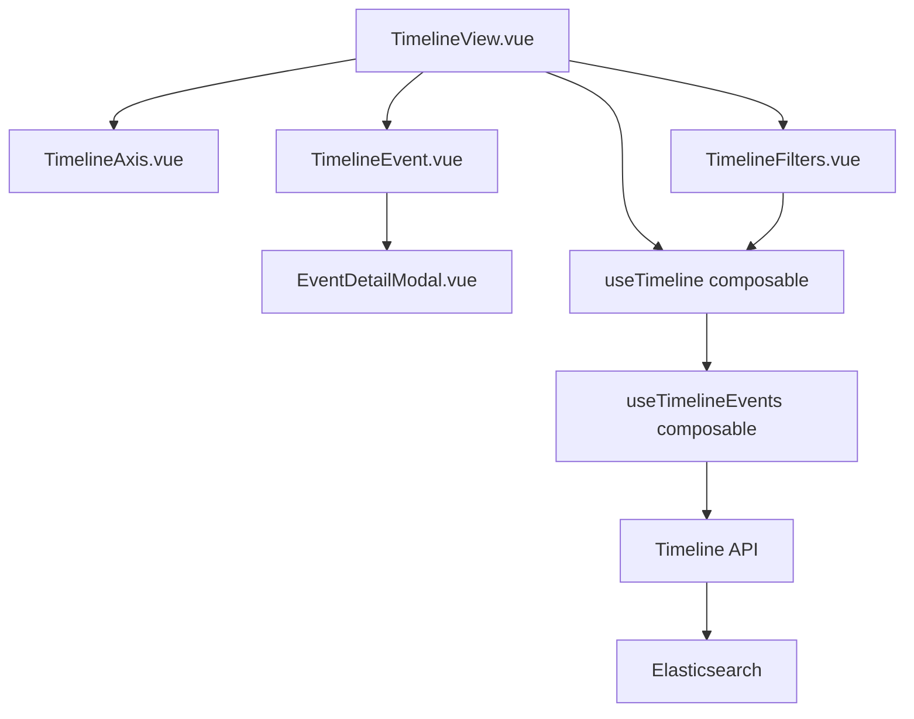

# Epic: Patient Timeline Module

## Overview

Implementation of an interactive patient timeline visualization that displays chronological clinical events extracted via NLP. This epic covers frontend timeline component, backend API endpoint, Elasticsearch integration, and clinical validation.

**PRD**: `.claude/ccpm/prds/timeline-module.md`
**Target**: 8 weeks (Sprint 4-5)
**Dependencies**: Search module (Sprint 1-2), MedCAT Service (Phase 3)

## Technical Architecture

### Frontend Stack
```
frontend/src/
├── components/timeline/
│   ├── TimelineView.vue           # Main timeline container
│   ├── TimelineAxis.vue           # D3.js timeline axis
│   ├── TimelineEvent.vue          # Individual event marker
│   ├── TimelineFilters.vue        # Filter controls
│   └── EventDetailModal.vue       # Event detail popup
├── composables/
│   ├── useTimeline.ts             # Timeline state management
│   └── useTimelineEvents.ts       # Event data fetching
└── utils/
    └── timelineCalculations.ts    # Date/position calculations
```

### Backend Stack
```
backend/app/
├── api/v1/endpoints/
│   └── timeline.py                # Timeline API endpoint
├── services/
│   └── timeline_service.py        # Business logic
├── schemas/
│   └── timeline_schema.py         # Pydantic models
└── db/
    └── timeline_queries.py        # Elasticsearch queries
```

### API Design

**Endpoint**: `POST /api/v1/timeline/patient/{patient_id}`

**Request**:
```json
{
  "date_range": {
    "start": "2020-01-01",
    "end": "2025-01-01"
  },
  "event_types": ["diagnosis", "procedure", "medication", "lab", "visit"],
  "specialty_filter": "cardiology",
  "page": 1,
  "page_size": 1000
}
```

**Response**:
```json
{
  "patient_id": "P12345",
  "patient_name": "John Doe",
  "date_range": {
    "start": "2020-01-01",
    "end": "2025-01-01"
  },
  "events": [
    {
      "id": "evt_123",
      "type": "diagnosis",
      "name": "Atrial Fibrillation",
      "date": "2021-06-15T10:30:00Z",
      "confidence": 0.92,
      "source_document_id": "doc_456",
      "meta_annotations": {
        "negation": "Affirmed",
        "temporality": "Current",
        "experiencer": "Patient",
        "certainty": "Definite"
      },
      "details": {
        "icd_code": "I48.0",
        "snomed_code": "49436004"
      }
    }
  ],
  "total_events": 237,
  "metadata": {
    "query_time_ms": 450,
    "cache_hit": false
  }
}
```

### Database Schema

**Elasticsearch Index**: `patient_events`

```json
{
  "mappings": {
    "properties": {
      "patient_id": { "type": "keyword" },
      "event_type": { "type": "keyword" },
      "event_name": { "type": "text" },
      "event_date": { "type": "date" },
      "confidence_score": { "type": "float" },
      "source_document_id": { "type": "keyword" },
      "meta_annotations": {
        "properties": {
          "negation": { "type": "keyword" },
          "temporality": { "type": "keyword" },
          "experiencer": { "type": "keyword" },
          "certainty": { "type": "keyword" }
        }
      },
      "clinical_codes": {
        "properties": {
          "icd10": { "type": "keyword" },
          "snomed": { "type": "keyword" }
        }
      }
    }
  }
}
```

### Component Architecture



## Implementation Phases

### Phase 1: Backend API (Week 1-2)

**Tasks**:
1. Create timeline API endpoint (`/api/v1/timeline/patient/{id}`)
2. Implement TimelineService (business logic)
3. Write Elasticsearch queries for event aggregation
4. Add filtering logic (date range, event types, specialty)
5. Implement pagination and caching (Redis)
6. Add audit logging for HIPAA compliance
7. Write API tests (unit + integration)

**Acceptance Criteria**:
- [ ] API returns events for patient_id
- [ ] Filtering works correctly (date, type, specialty)
- [ ] Response time <500ms for 1,000 events
- [ ] Pagination works (page_size 100-1000)
- [ ] Audit log entry created for each request
- [ ] Test coverage >90%

### Phase 2: Frontend Timeline Component (Week 3-4)

**Tasks**:
1. Create TimelineView.vue (main container)
2. Implement TimelineAxis.vue (D3.js horizontal timeline)
3. Create TimelineEvent.vue (event markers with color-coding)
4. Build TimelineFilters.vue (date range, event type filters)
5. Implement EventDetailModal.vue (event details popup)
6. Create useTimeline composable (state management)
7. Create useTimelineEvents composable (API integration)
8. Write component tests (Vitest)

**Acceptance Criteria**:
- [ ] Timeline renders with D3.js
- [ ] Events displayed as color-coded markers
- [ ] Zoom/pan controls work smoothly
- [ ] Clicking event opens detail modal
- [ ] Filters update timeline in real-time
- [ ] Responsive design (mobile, tablet, desktop)
- [ ] Test coverage >85%

### Phase 3: Integration & Testing (Week 5-6)

**Tasks**:
1. Integrate frontend timeline with backend API
2. Implement error handling (API failures, no data)
3. Add loading states and skeleton loaders
4. Implement caching in frontend (last viewed timeline)
5. Write E2E tests (Playwright)
6. Performance testing (1,000+ events)
7. Accessibility testing (WCAG 2.1 AA)
8. Security testing (HIPAA compliance audit)

**Acceptance Criteria**:
- [ ] End-to-end flow works (login → select patient → view timeline)
- [ ] Loading states displayed during API calls
- [ ] Error messages user-friendly
- [ ] Performance: timeline loads in <2 seconds
- [ ] All E2E tests passing
- [ ] Accessibility audit passes
- [ ] Security audit passes (no PHI leaks)

### Phase 4: Clinical Validation (Week 7)

**Tasks**:
1. Pilot with 5 cardiologists
2. Conduct usability testing (time-on-task study)
3. Collect feedback and iterate on UX
4. Fix bugs and edge cases
5. Create user documentation (screenshots + video)
6. Train clinical staff (2-hour session)

**Acceptance Criteria**:
- [ ] 5 clinicians complete pilot successfully
- [ ] Average time-on-task <5 minutes (target met)
- [ ] User satisfaction >4/5
- [ ] Critical bugs fixed
- [ ] Documentation complete
- [ ] Training session completed

### Phase 5: Production Deployment (Week 8)

**Tasks**:
1. Deploy backend API to production
2. Deploy frontend to production
3. Configure monitoring (APM, error tracking)
4. Set up alerts (performance, errors, security)
5. Create runbook for operations team
6. Soft launch to 20 users
7. Monitor metrics (adoption, performance, errors)
8. Full rollout to all users

**Acceptance Criteria**:
- [ ] Production deployment successful
- [ ] Monitoring dashboards configured
- [ ] Alerts triggering correctly
- [ ] No critical errors in first 48 hours
- [ ] Soft launch users report no issues
- [ ] Full rollout completed

## Dependencies

### External Dependencies
- **MedCAT Service**: Must be running and processing clinical notes
- **Elasticsearch**: Patient events index populated with NLP extractions
- **Authentication Service**: OAuth for clinician login
- **D3.js**: Timeline visualization library (v7.x)

### Internal Dependencies
- **Search Module**: Reuse SearchResults patterns
- **Backend API**: Timeline endpoint must be implemented first
- **DevOps**: Elasticsearch performance tuning

## Testing Strategy

### Unit Tests
- **Backend**: Test API endpoints, services, Elasticsearch queries
- **Frontend**: Test components, composables, utility functions
- **Target**: >90% coverage backend, >85% coverage frontend

### Integration Tests
- **API Integration**: Test full request/response cycle
- **Elasticsearch Integration**: Test actual queries against test index
- **Target**: All critical paths covered

### E2E Tests
- **User Workflows**: Login → select patient → view timeline → filter → drill down
- **Performance**: Load 1,000 events in <2 seconds
- **Target**: 10 key user journeys automated

### Security Tests
- **HIPAA Compliance**: Audit logging, PHI encryption, access control
- **Penetration Testing**: XSS, SQL injection, authentication bypass
- **Target**: Zero critical vulnerabilities

## Performance Targets

| Metric | Target | Measurement |
|--------|--------|-------------|
| Timeline Load Time | <2 seconds (10 years history) | APM P95 |
| API Response Time | <500ms (1,000 events) | APM P95 |
| Filter Response | <500ms | APM P95 |
| Concurrent Users | 100 simultaneous | Load testing |
| Uptime | 99.9% | Monitoring |

## Security Considerations

### HIPAA Compliance
- **Audit Logging**: Every timeline view logged (user_id, patient_id, timestamp)
- **Access Control**: RBAC enforced (only authorized clinicians)
- **Encryption**: TLS 1.3 in transit, AES-256 at rest
- **Session Management**: 15-minute timeout

### PHI Protection
- **No PHI in Logs**: Application logs contain patient_id only (no names/DOB)
- **No PHI in URLs**: Use patient_id (P12345) not patient names
- **Audit Trail**: All data access tracked for compliance
- **Data Minimization**: Return only necessary fields in API

## Rollout Plan

### Week 8: Phased Rollout
1. **Day 1-2**: Deploy to production (maintenance window)
2. **Day 3**: Soft launch to 20 pilot users (cardiology department)
3. **Day 4-5**: Monitor metrics, fix any critical issues
4. **Day 6**: Expand to 50 users (all cardiology)
5. **Day 7**: Full rollout to all clinicians (200+ users)

### Rollback Plan
- If critical issues arise, rollback to previous version
- Database/Elasticsearch changes are backward-compatible
- Feature flag allows disabling timeline without code deployment

## Success Metrics (Post-Launch)

### Week 1 Metrics
- Adoption: 30% of clinicians use timeline (60 users)
- Performance: 95% of loads <2 seconds
- Errors: <1% error rate
- Satisfaction: Initial feedback positive

### Month 1 Metrics
- Adoption: 60% of clinicians use timeline (120 users)
- Usage: Average 5 timeline views per user per day
- Clinical Impact: 15% more care gaps identified
- NPS: >30

### Month 3 Metrics
- Adoption: 80% of clinicians use timeline (160 users)
- Time Savings: 50% reduction in patient history review time
- Clinical Impact: 20% more care gaps identified
- NPS: >40

## Tasks Created

- [ ] 001.md - Create Timeline API Endpoint (parallel: true, P0, 6h)
- [ ] 002.md - Implement Timeline Service & Elasticsearch Integration (parallel: true, P0, 8h)
- [ ] 003.md - Create Frontend Timeline Components (parallel: false, P0, 10h)
- [ ] 004.md - Implement Timeline Filters & Event Detail Modal (parallel: false, P1, 8h)
- [ ] 005.md - Create Timeline Composables & State Management (parallel: true, P1, 6h)
- [ ] 006.md - Integration Testing & API Contract Tests (parallel: false, P1, 10h)
- [ ] 007.md - E2E Tests, Performance Testing & Accessibility Audit (parallel: false, P1, 12h)
- [ ] 008.md - Production Deployment, Monitoring & Documentation (parallel: false, P0, 10h)

**Total tasks**: 8
**Parallel tasks**: 3 (001, 002, 005)
**Sequential tasks**: 5 (003, 004, 006, 007, 008)
**Estimated total effort**: 70 hours (~9 working days)

## Parallelization Strategy

**Phase 1 (Week 1)**: Tasks 001 + 002 can run in parallel
- Task 001: API endpoint skeleton (6h)
- Task 002: Service layer & Elasticsearch (8h)

**Phase 2 (Week 2-3)**: Tasks 003 + 005 can run in parallel after 001/002 complete
- Task 003: Frontend components (10h) - depends on 001, 002
- Task 005: Composables (6h) - depends on 003

**Phase 3 (Week 3)**: Task 004 runs after 003
- Task 004: Filters & modal (8h) - depends on 003

**Phase 4 (Week 4)**: Task 006 runs after all components ready
- Task 006: Integration tests (10h) - depends on 001-005

**Phase 5 (Week 5)**: Task 007 runs after integration tests
- Task 007: E2E & performance tests (12h) - depends on 006

**Phase 6 (Week 6)**: Task 008 runs after all tests pass
- Task 008: Production deployment (10h) - depends on 007

## Next Steps

1. **GitHub Sync** (optional): Run `/pm:epic-sync timeline-module` to create GitHub issues
2. **Start Development**: Assign tasks to developers and begin Phase 1
3. **Parallel Execution**: Developers can work on tasks 001 and 002 simultaneously

---

**Created**: 2025-11-21T16:34:47Z
**Status**: Backlog
**Last Decomposed**: 2025-11-21T18:34:00Z
